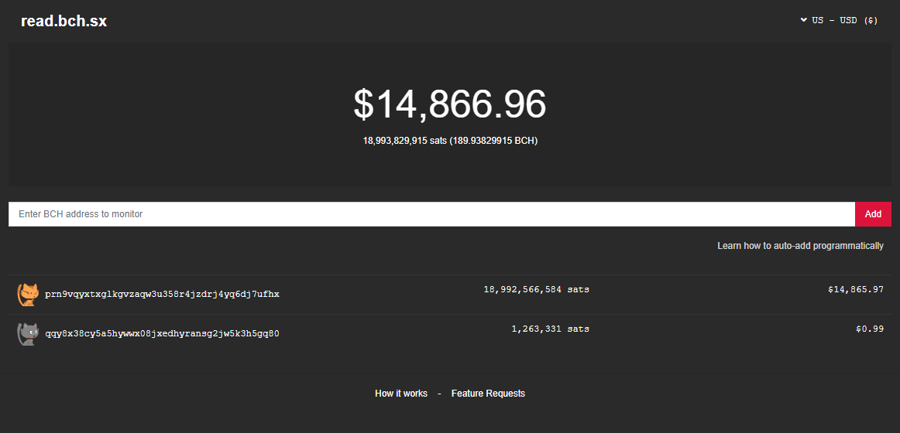

# Read.bch.sx

Manage multiple wallets from various Bitcoin applications, in one place, with zero risk.



## What

Read.bch.sx lets you manage multiple wallets from various applications (such as [memo.cash](https://memo.cash), [honest.cash](https://honest.cash), [blockpress](https://www.blockpress.com), etc.) in a single place.

1. **Add**: **Add wallets by public address** instead of going through hassle of importing private keys.
2. **Watch**: Watch all your app wallets in a single place.
3. **Manage**: Effortlessly recharge all your application wallets using QR code

## Why

We are on the verge of a cambrian explosion of "Bitcoin Apps". We already have several interesting apps running on top of Bitcoin Cash such as [memo.cash](https://memo.cash), [blockpress](https://www.blockpress.com), [honest.cash](https://honest.cash), etc. and there are tons more to come.

One notable thing about these apps is that **each app comes with its own embedded wallet**. This is great for user experience and also helps with reducing risk for users since each wallet is specific to its parent application.

However it's becoming hard to keep track of all the wallets across different apps. This is where **read.bch.sx** comes in.

1. read.bch.sx provides a unified dashboard where you can manage all your coins across multiple apps with a simple interface.
2. read.bch.sx **ONLY monitors public addresses instead of importing private keys**. This means nothing bad can ever happen by using read.bch.sx. Feel free to add as many wallets as you want, with zero risk.

## Features

Here are some highlights that make read.bch.sx uniquely useful.

1. **Simple and Readonly**: It's for "Reading" from wallets. There's no private key management, no seed phrase, no complex stuff. Just add some public Bitcoin addresses from all your Bitcoin apps and you're set to go.
2. **Monitor changes**: Whenever you refresh the page, read.bch.sx lets you know if there has been a new spend or a new incoming transaction making it easy for you to keep scores. 
3. **Zero Risk**: read.bch.sx doesn't import any private keys because all you add is public address. There is zero risk of losing money from read.bch.sx, so add as many as you want.
4. **Monitor anything**: Since it works by adding public addresses, you can monitor any Bitcoin wallet--even those you don't own.
5. **100% Serverless**: The entire app is purely frontend based HTML. There is no backend that stores your data. In fact, you can even run it on your own local machine if you want. The source code is 100% open source and designed to be as transparent as possible.
6. **Charge your wallets effortlessly**: read.bch.sx implements a couple of powerful ways to charge your wallets, including QR Code. You no longer need to charge wallets from each app, you can do it all in one place.
7. **Multi-currency**: You can use read.bch.sx with whichever currency you choose.

## How to Use

### 1. Add Wallets

Try the app at [https://read.bch.sx](https://read.bch.sx). Some of the things you can try are:

1. Add your [memo.cash](https://memo.cash) wallet
2. Add your [blockpress](https://www.blockpress.com) wallet
3. Add your [honest.cash](https://honest.cash) wallet

As you start adding wallets, you'll see that the header displays the total sum of all the coins in your wallets.

### 2. Watch 

If you have acccounts in any of the above services, try making a transaction (such as posting a memo), and come back to read.bch.sx and refresh, you'll see that your balance has gone down. Likewise, you'll see a green arrow when there's an incoming transaction (like a tip).

### 3. Charge your wallets

There are two ways to charge your wallets.

1. **QR Code**: If you already have a mobile phone wallet, you can scan the QR code to charge your wallets.

### 4. Request Payment

When requesting a payment, you can simply pick one of the wallets and share its "share" url. A share URL looks like this:

```
https://read.bch.sx/share#[WALLET_ADDRESS]
```

### 5. Programmatically Add Wallets to read.bch.sx

You can enter addresses manually to the input box to add to read.bch.sx, but sites can also integrate with read.bch.sx easily, simply by linking to a URL of the following format:

```
https://read.bch.sx/add#[WALLET_ADDRESS]
```

Here's what it looks like in practice (If you integrated into your website):

```
<a href='https://read.bch.sx/add#qq4kp3w3yhhvy4gm4jgeza4vus8vpxgrwc90n8rhxe'>Add to read.bch.sx</a>
```

Remember, there is no server. The entire web app is just a static HTML website hosted on Github. So feel free to integrate read.bch.sx into your apps as much as you want.

### 6. Programmatically Add Multiple Wallets

If you want to add multiple wallets with one request, you can do the same, but this time separate the multiple wallet addresses by commas. Here's an example:

```
https://read.bch.sx/add#qppsyzk4wzaqp4g5s4n86t7889m4ydm37gms9ya3p5,qpne29ue8chsv9pxv653zxdhjn45umm4esyds75nx6,qq4kp3w3yhhvy4gm4jgeza4vus8vpxgrwc90n8rhxe
```

## Contribute

read.bch.sx is [completely open source](./LICENSE), feel free to [send pull requests](https://github.com/unwriter/readcash/pulls) or [start a dicscussion](https://github.com/unwriter/readcash/issues) if you have feature requests.
